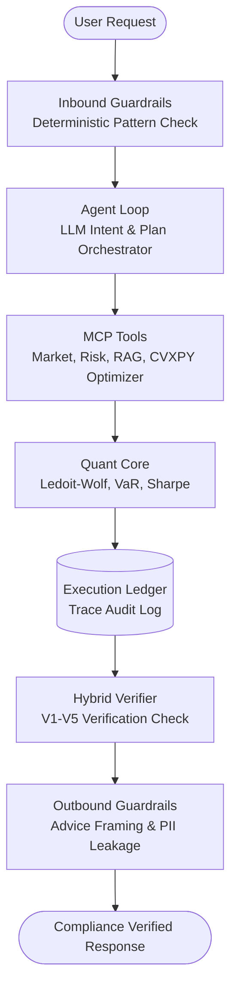

# QuantAgent: Governed Financial Analysis Agent

QuantAgent is a governed financial analysis agent designed to solve the critical compliance and reliability problems inherent in applying Large Language Models (LLMs) to quantitative finance. By separating the system into a non-deterministic planning loop and a deterministic execution core, backed by a hybrid verification engine, QuantAgent ensures that every numerical claim is strictly grounded in data, no math is performed by the LLM, and compliance guardrails are strictly enforced before any response reaches the user.

Full design: [`docs/architecture.md`](docs/architecture.md). Implementation guideline and
milestone plan: [`docs/guideline.md`](docs/guideline.md). Living status doc — exact resume state,
what's done vs. disclosed-as-incomplete for each milestone: [`docs/PROGRESS.md`](docs/PROGRESS.md).

**Status:** M0-M5 done and verified (`make check` green: 652 tests, 96% coverage). M6
(observability/evals/hardening) and M7 (portfolio engine) partially done — see
`docs/PROGRESS.md` for exactly what's real vs. still outstanding in each.

---

## Reliability Scorecard

Reliability metrics QuantAgent measures against `docs/architecture.md` §10.4's targets. All four
rows are now real, reproducible numbers computed by code in this repo — none are placeholders. The
first two are written to `evals/scorecard.md` by `make eval`; the other two are reproduced with the
commands in the last column (see the "How to reproduce" column).

| Metric | Target | Measured Value | How to reproduce |
| :--- | :--- | :--- | :--- |
| **Hallucinated-Number Rate** | 0.00% | **0.00%** (deterministic golden set, 8 fixtures) | `make eval-grounding` |
| **Citation Precision** | ≥ 98.0% | **100.0%** (deterministic golden set, 5 fixtures) | `make eval` |
| **Tool-Selection F1 Score** | ≥ 90.0% | **91.7%** (8 golden traces, live model; 3 repeat runs: 93.3% / 91.7% / one run crashed the harness before a fix — see below) | `make eval-tools` |
| **p95 Latency / Cost per Request** | < 9s / < $0.06 | Not a formal p95 (single anecdotal sample: **~90s**, $0.00) | `make dev`, then read `latency_ms`/`cost_usd` per call from `GET /v1/traces/{id}` |

The two "deterministic golden set" rows are measured against a small, hand-curated fixture set
with unambiguous ground truth (architecture.md §10.2's own caveat) — this proves the verifier's
logic is correct against a controlled set, not real-world precision/recall against live model
output or a large labelled corpus.

**The Tool-Selection F1 and latency/cost rows are model-dependent** — measured against `gemma4:26b`,
a small local model reached through a company Open WebUI proxy (see `.env.example`'s
`ANTHROPIC_BASE_URL`/`ANTHROPIC_API_KEY` comments), not the Claude models `config.py` defaults to.
Both repeat runs clear the target, but most of the 8 traces need the one permitted schema-retry
(guideline.md §7) before succeeding, and the number moves run to run (91.7–93.3%) — real LLM
non-determinism, not measurement noise. Two real, fixed-in-place findings came out of running this
against an imperfect model instead of only Claude: (1) the intent/planner prompts stated their
JSON schema but never told the model in plain language to keep `rationale` under its 280-char
limit or to include every field on every plan step — fixed in `prompts/intent/classify.v1.jinja`
and `prompts/planner/dag.v1.jinja` (a worked example added to the latter); (2) this eval script
originally let one trace's unrecoverable `StructuredOutputError` crash the entire run instead of
recording it as a real F1=0 miss and continuing — fixed in `evals/eval_tool_selection.py`. Re-run
with a real `ANTHROPIC_API_KEY` (or point `ANTHROPIC_BASE_URL` at a stronger model) for a
like-for-like comparison; latency/cost in particular should improve substantially with a faster
provider — the ~90s anecdotal sample above is this local model's, not an architectural ceiling.

---

## System Architecture



### The Determinism Boundary
- **Non-Deterministic (LLM)**: Intent classification, tool sequence planning, and synthesis of natural language explanations.
- **Deterministic (Quant/Rules)**: Metric calculations, portfolio optimization (using CVXPY), input/output guardrail scanning, and V1-V5 verification checking. No formulas are written or computed by the LLM.

---

## Worked Example: Portfolio Rebalancing (M7)

Below is the real output generated by the portfolio optimization and trade simulation suite —
verified byte-for-byte reproducible by running `uv run python scripts/demo_rebalance.py`. This is
the **offline/synthetic-data path** (see Quickstart §3): real CVXPY optimization math, on a
synthetic deterministic price panel, not live market data.

```
1. Optimizing portfolio 'pf_demo' using 'min_variance' objective...

--- Portfolio Optimization Results ---
Objective: MIN_VARIANCE
As of: 2021-11-30
Current Expected Return: 4.59%
Current Volatility:      5.50%
Current Sharpe Ratio:    0.84
Target Expected Return:  2.78%
Target Volatility:      5.23%
Target Sharpe Ratio:    0.53
Ex-Ante Delta Risk:      -0.27%

Proposed Rebalance Trades:
  SELL  KO    weight: 16.92% -> 11.11% (delta: -5.81%) | value: $3,298.13 | qty: 34.33
  SELL  XOM   weight: 14.29% -> 11.11% (delta: -3.18%) | value: $1,805.88 | qty: 13.35
  SELL  AMD   weight: 14.16% -> 11.11% (delta: -3.05%) | value: $1,730.83 | qty: 17.22
  SELL  NVDA  weight: 12.80% -> 11.11% (delta: -1.69%) | value: $957.72 | qty: 7.91
  SELL  JNJ   weight: 12.41% -> 11.11% (delta: -1.30%) | value: $738.81 | qty: 5.76
  BUY   PG    weight:  8.70% -> 11.11% (delta: +2.41%) | value: $1,370.91 | qty: 13.88
  BUY   MSFT  weight:  8.03% -> 11.11% (delta: +3.08%) | value: $1,751.14 | qty: 15.37
  BUY   AAPL  weight:  6.55% -> 11.11% (delta: +4.56%) | value: $2,588.27 | qty: 34.77
  BUY   JPM   weight:  6.14% -> 11.11% (delta: +4.97%) | value: $2,821.05 | qty: 36.39

2. Simulating trade impact of the proposed weights...

--- Trade Impact Simulation Results ---
Total Trade Value:   $17,062.74
Estimated Cost:      $21.01
Portfolio Turnover:  15.02%
```

---

## Quickstart (Under 5 Minutes)

### 1. Installation
```bash
uv sync --extra dev
cp .env.example .env
```

### 2. Run Tests
```bash
make check          # lint + typecheck + arch + unit/e2e/property tests (no external services needed)
make eval            # deterministic reliability scorecard -> evals/scorecard.md
```

### 3. Run the Demo — two paths, be clear about which one you're on

**Offline/synthetic path (no setup beyond step 1):** the demo script falls back to a synthetic,
deterministic price panel and an in-memory demo portfolio when it can't reach Postgres. This
exercises the real CVXPY optimizer and real quant math, on **synthetic, not live, market data**.
```bash
uv run python scripts/demo_rebalance.py
```

**Real-data path** (real Postgres+pgvector via Docker, real yfinance prices, a seeded demo
portfolio):
```bash
docker compose up -d
make migrate
make seed
uv run python scripts/demo_rebalance.py   # now hits the real DB/portfolio instead of falling back
```

**Full agent loop with a live LLM** (plans, synthesizes, and verifies a real natural-language
answer) additionally needs `ANTHROPIC_API_KEY` set in `.env`, then:
```bash
make dev                                    # starts the API on :8000
curl -N -X POST localhost:8000/v1/analyze \
  -H 'Content-Type: application/json' -H 'X-Tenant-Id: tenant_demo' \
  -d '{"question": "Am I overexposed to AI stocks?", "portfolio_id": "pf_demo"}'
```

---

## Limitations and Disclosures

> [!WARNING]
> **Not Investment Advice / Not a Trading System**
> This system is for educational and informational purposes only. It is not an offer or solicitation to buy or sell securities. Past performance is not indicative of future results. Portfolio optimization results are based on simulated data models and do not guarantee actual performance or profit.
